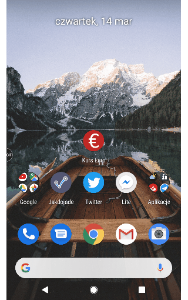
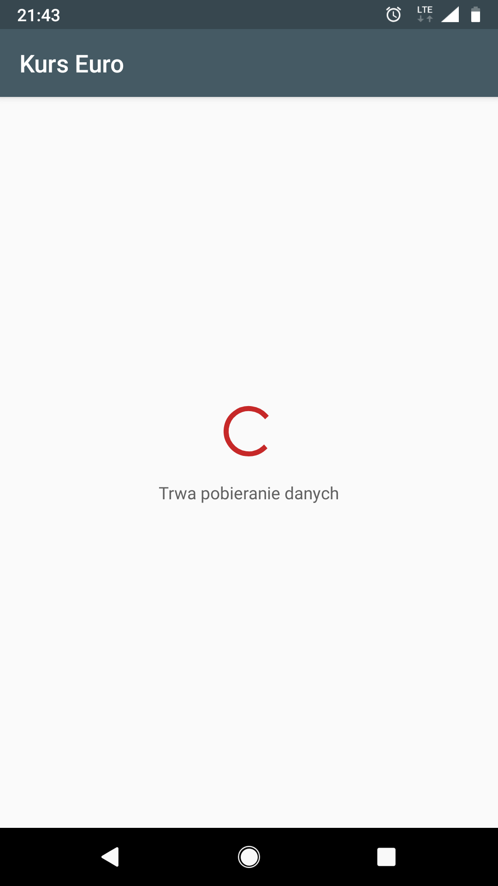
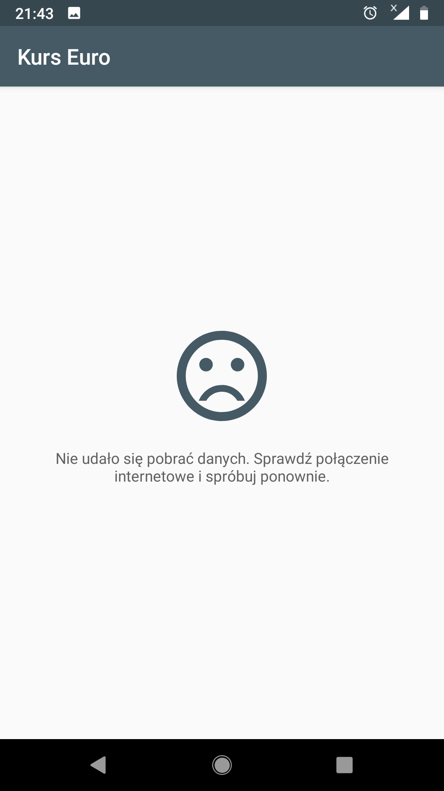
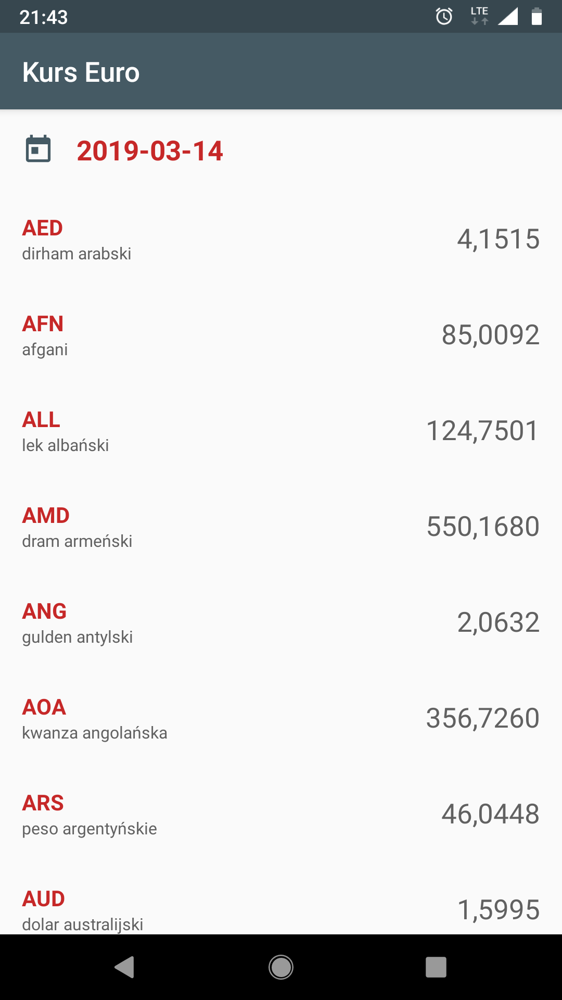
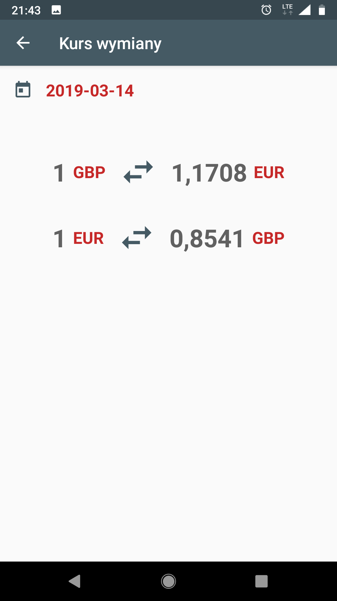

# Exchange-Rates
This app shows exchange rates for EUR. By scrolling down more data is loading (day by day).

### Screenshots
App looks like as screenshots below. To get builded APK go to [apk](apk) folder.

    

